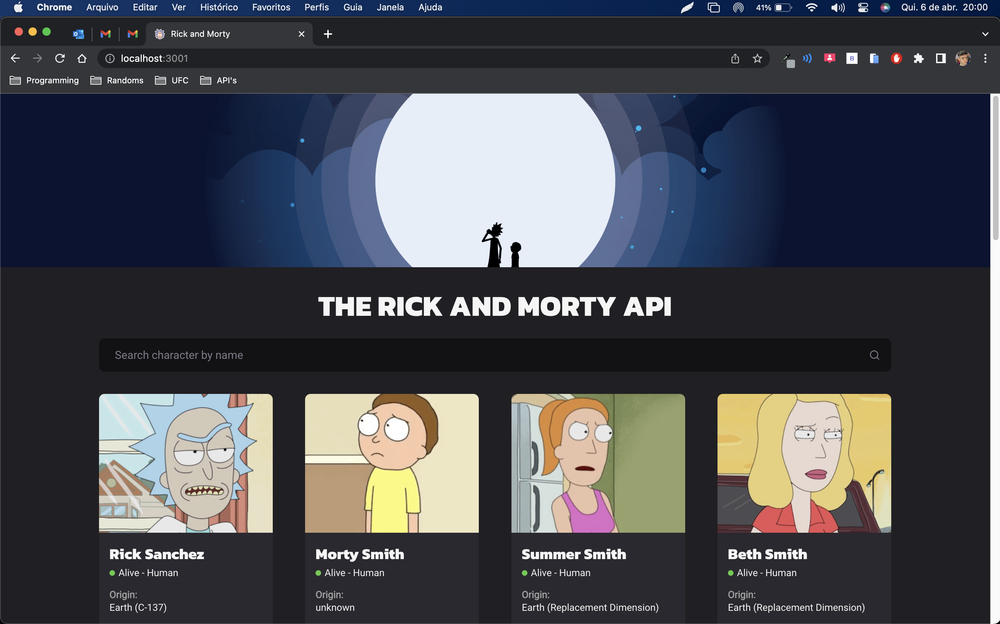
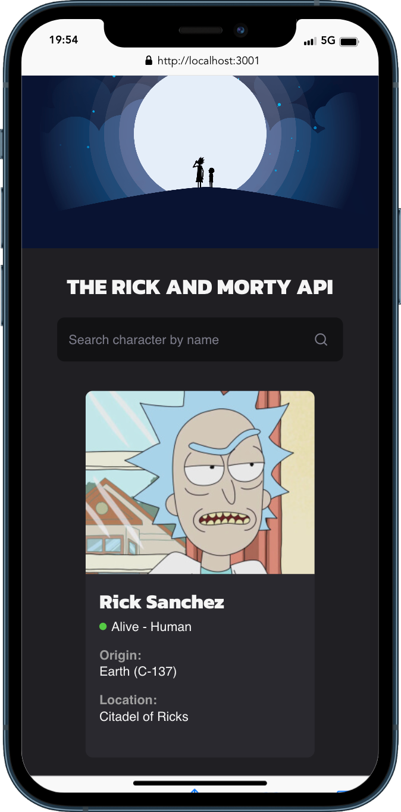
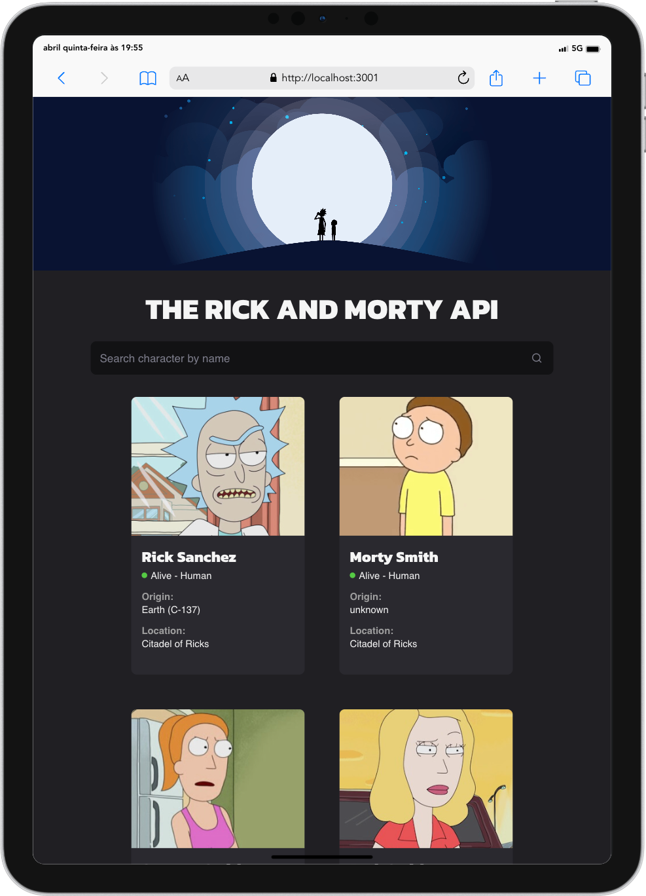

<h1 style="text-align: center; font-weight: bold;">Rick and Morty API</h1>

## Sobre o Projeto

A Rick and Morty API é o melhor site para encontrar os personagens da série!

Link da aplicação em produção:

https://rick-and-morty-ms.surge.sh/

### Tecnologias Usadas

- [React](https://pt-br.reactjs.org/)
- [TypeScript](https://www.typescriptlang.org/)
- [Styled Components](https://styled-components.com/)
- [Axios](https://axios-http.com/ptbr/docs/intro)
- [React Router](https://reactrouter.com/en/main)
- [React Hook Form](https://react-hook-form.com/)
- [Rick and Morty API](https://rickandmortyapi.com/)

### Como rodar a aplicação

```bash
# Clone este repositório
$ git clone https://github.com/marrcelosantana/rick-and-morty-web
# Acesse a pasta do projeto
$ cd rick-and-morty-web
# Instale as dependências
$ npm install
# ou
$ yarn
# Execute a aplicação em modo de desenvolvimento
$ npm run dev

```

### Imagens

|                 Web                 |
| :---------------------------------: |
|  |

|                 Iphone                 |                 Ipad                 |
| :------------------------------------: | :----------------------------------: |
|  |  |
